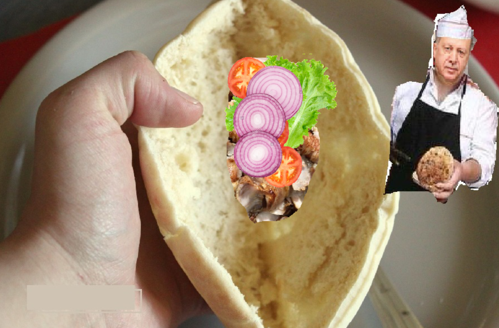

# Kebab Virtuel

Application *-inutile-* développée pour tester les communications Ivy.  
Définition via la parole et affichage du contenu d'un kebab.  
Le module sra5 permet l'écoute de l'utilisateur et le module ppilot5 permet au maître kebabiste de répondre à l'utilisateur pour une expérience immersive à la pointe de la technologie. 🤡  

> Communications sur 127.255.255.255:2010

## Besoins :
- Python
- pygame
  ```
  pip install pygame
  ```
- ivy-python
  ```
  pip install ivy-python
  ```
- Java


## Utilisation :

1. Lancez l'exécution de **ppilot5/ppilot5.exe**  
  *(facultatif, permet simplement d'entendre les répliques du maitre kebabiste)*
2. Lancez l'exécution de **sra5/sra5_on.bat**  
  *(si vous ne souhaitez pas parler, exécutez plutôt sra5/simu_vocal_dev.py qui vous permet de simuler vos paroles)*
3. Lancez l'exécution de **ivy_kebab.py**
4. Préparez votre meilleure recette !  
  *(ingrédients disponibles : viande, salade, tomate, oignon)*

>  Si vous vous trouvez dans un lieu avec du bruit ambiant, les performances du module sra5 seront affectées. Aussi si vous n'utilisez pas de casque/écouteurs audio, les paroles émises par ppilot5 peuvent affecter la compréhension de sra5 en étant captées par votre micro.

## Exemple d'exécution :
